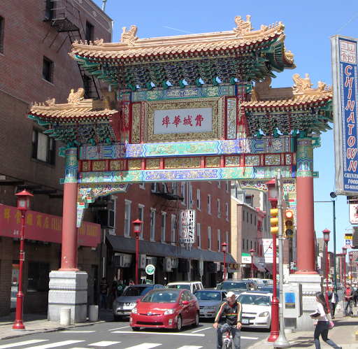

```{css format, echo = FALSE}
.center-leaflet {
  display: flex;
  justify-content: center;
}

```


```{r setup_general, message = FALSE, warning = FALSE}
knitr::opts_chunk$set(echo = TRUE, warning = FALSE, message = FALSE, cache = FALSE, fig.show = "asis",
    fig.align = "center") 
options(scipen=999)


library(sf)
library(ggplot2)
library(tidycensus)
library(tidyverse)
library(ggtext)
library(glue)
library(leaflet)
library(mapview)
library(patchwork)
library(lwgeom)
library(FNN)
library(kableExtra)
library(corrplot)
library(htmltools)  # For div() function
library(knitr) # insert images

source("https://raw.githubusercontent.com/urbanSpatial/Public-Policy-Analytics-Landing/master/functions.r")
```

```{r setup_wd, message = FALSE}
# Change to your own workspace
knitr::opts_knit$set(root.dir = "E:/Spring/Practicum/DataAnalysis/Chinatown")
wd <- "E:/Spring/Practicum/DataAnalysis/Chinatown"

# for Aki
# knitr::opts_knit$set(root.dir = "~/Documents/MUSA/Spring25/MUSA8010_Practicum/Chinatown/")
# wd <- "~/Documents/MUSA/Spring25/MUSA8010_Practicum/Chinatown/"
```


# Use Case

## Background

It is hard to talk about the history of the **Philadelphia Chinatown** without the construction of **I-676**, also known as the **Vine Street Expressway**. Although the highway serves as a significant thoroughfare through Center City Philadelphia, the indispensable repercussion on the adjacent neighborhoods still lingers today. Consequences of the highway such as demolishment of buildings, pedestrian safety threats, traffic congestion, as well as noise and air pollutions had been harming Chinatown and its surrounding neighborhoods over the past decades and are yet to be addressed. 

Standing in opposition to the issues, **City of Philadelphia Office of Transportation and Infrastructure and Sustainability (OTIS)** brought forth the plan of capping sections of the expressway as a solution to address its historical harms on the Chinatown region. This “cap”, named **the Chinatown Stitch project**, aimed to create a safe and equitable green space for the public that would reconnect areas north and south to the Vine Street expressway. Receiving funds from the US department of Transportation and the local organizations, the construction of the Chinatown Stitch will start in 2027 and is expected to be completed in early 2030.

This purpose of this study is to help OTIS **understand the housing market of Philadelphia Chinatown region before and after the implementation of the Chinatown Stitch**. The first part of the study will focus the effects of highways on sales prices in the study region as well as the entire Philadelphia. House prices will then be estimated using **three predictive models under three different future scenarios**: business as usual without the implementation of the Chinatown Stitch, business as usual with the implementation of the Chinatown Stitch, and an alternative future in which the Chinatown Stitch significantly reshapes the urban landscape of the study region.


## Study Area

```{r StudyArea_data, quiet = TRUE, results = 'hide'}
Philly_blockgroup <- st_read("Dataset/Philly_blockgroup/Philly_blockgroup.shp") %>%
  st_transform('EPSG:2272')

# philly bounds
philly_bounds <- st_union(Philly_blockgroup)

studyarea <- st_read("Dataset/studyarea/StudyArea.shp") %>%
  st_transform('EPSG:2272')

studyarea_blockgroup <- st_read("Dataset/studyarea/StudyArea_blockgroup_tract.shp") %>%
  st_transform('EPSG:2272')

studyarea_north <- st_read("Dataset/studyarea-sub/studyarea_north.shp") %>%
  st_transform('EPSG:2272')

studyarea_south <- st_read("Dataset/studyarea-sub/studyarea_south.shp") %>%
  st_transform('EPSG:2272')

I_676 <- st_read("Dataset/Highways/I_676.shp") %>%
  st_transform('EPSG:2272')

discontinuity <- st_read("Dataset/studyarea-sub/discontinuity.shp") %>%
  st_transform('EPSG:2272')

Chinatown_Stitch <- st_read("Dataset/Chinatown_Stitch/Chinatown_Stitch.shp") %>%
  st_transform('EPSG:2272')

property_original <- st_read("Dataset/original_property_studyarea.geojson") %>%
  st_transform('EPSG:2272')

property_north <- property_original %>%
  st_intersection(studyarea_north)

property_south <- property_original %>%
  st_intersection(studyarea_south)

# philly hydrology for mapping (bounded by philly_bounds; source: https://opendataphilly.org/datasets/hydrology/)
hydro <- st_read("https://services.arcgis.com/fLeGjb7u4uXqeF9q/arcgis/rest/services/Hydrographic_Features_Poly/FeatureServer/1/query?outFields=*&where=1%3D1&f=geojson") %>% 
    st_transform(crs = 'EPSG:2272') %>% 
  st_intersection(philly_bounds)

philly_highways <- st_read("Dataset/Highways/Casestudy_Highways.shp")

```


Three study areas are used in the analysis to reveal the effects of I-676 on the land market of the Chinatown region.

+ **Referable study area (Philadelphia):** to analyse the impact of different highways on the surrounding land markets in the context of the city.
+ **Main study area (10 block groups):** to figure out the correlation between I-676 and property sales price and make future predictions based on three potential scenarios.
+ **Compared study area (north and south sides):** to investigate the different situations of the Chinatown region under the construction of I-676.


```{r StudyArea_plot}
StudyArea_plot1 <- ggplot() +
  geom_sf(data = Philly_blockgroup, fill = "transparent", color = "grey90", linewidth = .2) +
  geom_sf(data = studyarea, fill = "#eb5600", color = "#eb5600") +
  geom_sf(data = hydro, fill = "#DFF3E3", color = "transparent") +
  geom_sf(data = philly_bounds, fill = "transparent", color = "grey60", linewidth = 1, linetype = "dashed") +
  theme_void() +
  labs(title = "Three Study Areas:",
       subtitle = "Philadelphia | 10 Block Groups around the Chinatown Stitch | North and South Sides",
       caption = "Source: ACS Census Data and OPA Data.") +
  theme(plot.title = element_text(size = 16, face = "bold",margin = margin(b = 6)),
        plot.subtitle = element_text(margin = margin(b = 10)),
        plot.caption = element_text(hjust = 0, margin = margin(t = 10)))

StudyArea_plot2 <- ggplot() +
  geom_sf(data = studyarea_north, fill = alpha("#eb5600", .1), color = "transparent") +
  geom_sf(data = studyarea_south, fill = alpha("#1a9988", .1), color = "transparent") +
  # geom_sf(data = discontinuity, fill = "black", color = "transparent") +
  geom_sf(data = Chinatown_Stitch, fill = "grey", color = "transparent", linetype = "dashed", linewidth = 1) +
  geom_sf(data = studyarea_blockgroup, fill = "transparent", color = "grey", linewidth = .8, linetype = "dashed") +
  geom_sf(data = property_north, color = "#eb5600", size = .6) +
  geom_sf(data = property_south, color = "#1a9988", size = .6) +
  geom_sf(data = studyarea, fill = "transparent", color = "grey60", linewidth = 1.2, linetype = "dashed") +
  theme_void()

StudyArea_plot1 | StudyArea_plot2

```


```{r UseCase_data, quiet = TRUE, results = 'hide'}
studyarea_4326 <- st_transform(studyarea, crs = 4326)
bbox <- as.list(st_bbox(studyarea_4326))

ChinatownStitch_4326 <- st_read("Dataset/Chinatown_Stitch/Chinatown_Stitch.shp") %>%
  st_transform('EPSG:4326')

I676_4326 <- st_transform(I_676, crs = 4326)

landuse_4326 <- st_read("Dataset/landuse_clip/Land_Use_ClipLayer.shp") %>%
  st_transform('EPSG:4326')

landuse_4326_plot <- landuse_4326 %>%
  filter(C_DIG2DESC != 51 & C_DIG2DESC != 71)

landuse_park_ing <- landuse_4326 %>%
  filter(OBJECTID_1 == 514214)

park <- st_read("Dataset/ParksModified/Parks_within_1km.shp") %>%
  st_transform('EPSG:4326')

nhoods_4326 <- 
  st_read("DataWrangling/data/philadelphia-neighborhoods.geojson") %>%
  # st_read("data/philadelphia-neighborhoods.geojson") %>%
  st_transform('EPSG:4326')

Chinatown_Callowhill <- nhoods_4326 %>%
  filter(NAME %in% c("CHINATOWN", "CALLOWHILL"))
```

In the vision of **a city park** in the future, the Chinatown Stitch will bring vitality to local residents and visitors along with other green spaces. Connected with the Stitch, the **Rail Park** in the <span style="color: #eb5600;">north (Callowhill neighborhood)</span> is still in construction and will make an impact years later. With a foundation of **cultural and commercial resources**, the <span style="color: #1a9988;">southern part (Chinatown neighborhood)</span> will provide services to the surrounding area, including the city center of Philadelphia.

```{r UseCase_plot}
UseCase <- leaflet() %>%
  addProviderTiles(providers$CartoDB.Positron) %>%
  addPolygons(data = studyarea_4326,
              color = "black",       # Black border
              weight = 4,            # Border thickness
              dashArray = "8,12",     # Dashed line pattern (5px on, 5px off)
              fill = FALSE) %>%
    addPolygons(data = landuse_4326_plot,
              color = "grey",
              weight = 0.8,
              fillColor = "#DFF3E3",
              fillOpacity = 0.4) %>%
  addPolygons(data = Chinatown_Callowhill,
              color = "#eb5600",
              weight = 1,
              opacity = 0.5,
              dashArray = "5,5",
              fillColor = "#eb5600",
              fillOpacity = 0.1) %>%
  addPolygons(data = park,
              color = "#1a9988",
              weight = 1,
              fillOpacity = 0.6,
              fillColor = "#1a9988") %>%
  addPolygons(data = landuse_park_ing,
              color = "#1a9988",
              weight = 2,
              opacity = 0.8,
              fill = FALSE) %>%
  addPolylines(data = I676_4326,
               color = "#eb5600",
               opacity = 1,
               weight = 2) %>%
  addPolygons(data = ChinatownStitch_4326,
              color = "#eb5600",
              weight = 2,
              opacity = 1,
              fillColor = "#1a9988",
              fillOpacity = 0.8
              # fill = alpha("#1a9988", 0.5)
              ) %>%
  fitBounds(
    lng1 = bbox$xmin, 
    lat1 = bbox$ymin, 
    lng2 = bbox$xmax, 
    lat2 = bbox$ymax
  )

div(class = "center-leaflet", UseCase)
```

```{r StudyArea_pictures, echo=FALSE}
# Create a table with images and captions
kable(
  data.frame(
    Callowhill = c("{height=350px}", "Callowhill"),
    Chinatown = c("{height=350px}", "Chinatown")
  ),
  format = "html",
  align = "c",
  col.names = NULL
) %>%
  kable_styling(position = "center")

```


## Methodology

To achieve the goal of **a data-rich story map**, the methodology is structured around **a robust model construction process**. By incorporating illustrative data visualizations throughout the data analysis, the story map features engaging maps and compelling narratives.


# Data Wrangling

## Property Data

+ [Philadelphia Properties and Assessment History](https://opendataphilly.org/datasets/philadelphia-properties-and-assessment-history/)
+ [Lans use 2023](https://opendataphilly.org/datasets/land-use/)

```{r property_data, quiet = TRUE, results = 'hide'}
# property <- st_read("DataWrangling/data/opa_properties_public.geojson") %>%
#   st_transform('EPSG:2272')
# 
# property_studyarea <- st_intersection(property, studyarea)
# 
# st_write(property_studyarea %>% st_transform('EPSG:3857'), "Dataset/original_property_studyarea.geojson", driver = "GeoJSON")

property_studyarea <- st_read("Dataset/original_property_studyarea.geojson") %>%
  st_transform('EPSG: 2272')

landuse <- st_read("Dataset/landuse_clip/Land_Use_ClipLayer.shp") %>%
  st_transform('EPSG:2272')

landuse_rename <- landuse %>%
  mutate(landuse = 
           case_when(
    C_DIG2DESC == 11 ~ "Residential Low",
    C_DIG2DESC == 12 ~ "Residential Medium",
    C_DIG2DESC == 13 ~ "Residential High",
    C_DIG2DESC == 21 ~ "Commercial Consumer",
    C_DIG2DESC == 22 ~ "Commercial Business/Professional",
    C_DIG2DESC == 23 ~ "Commercial Mixed Residential",
    C_DIG2DESC == 31 ~ "Industrial",
    C_DIG2DESC == 41 ~ "Civic/Institution",
    C_DIG2DESC == 51 ~ "Transportation",
    C_DIG2DESC == 61 ~ "Culture/Amusement",
    C_DIG2DESC == 62 ~ "Active Recreation",
    C_DIG2DESC == 71 ~ "Park/Open Space",
    C_DIG2DESC == 72 ~ "Cemetery",
    C_DIG2DESC == 81 ~ "Water",
    C_DIG2DESC == 91 ~ "Vacant",
    C_DIG2DESC == 92 ~ "Other/Unknown"
  ))

# philly properties (from Sijia)
# from the last 5 years, inflation-adjusted prices, total area > 100 sq ft, prices > 30,000, outliers above 5 SD from the mean were removed
philly_properties <- st_read("data/property_philly_250318.geojson")
```


## Census Data

## Neighborhood Context

+ [PPR Properties](https://opendataphilly.org/datasets/ppr-properties/)
+ [Neighborhoods](https://opendataphilly.org/datasets/philadelphia-neighborhoods/)
+ [Trolley Stations](https://hub.arcgis.com/datasets/dd2afb618d804100867dfe0669383159_0/explore?location=39.956470%2C-75.160382%2C14.19)
+ [Highspeed Stations](https://hub.arcgis.com/datasets/af52d74b872045d0abb4a6bbbb249453_0/explore?location=39.955164%2C-75.153952%2C14.43)
+ [Bike Network](https://opendataphilly.org/datasets/bike-network/)
+ [311 Requests](https://opendataphilly.org/datasets/311-service-and-information-requests/)

```{r neighborhood_wrangle, quiet = TRUE, results = 'hide'}
nhoods <- 
  st_read("Dataset/DataWrangle/philadelphia-neighborhoods.geojson") %>%
  st_transform('EPSG:2272')

park <- 
  st_read("https://opendata.arcgis.com/datasets/d52445160ab14380a673e5849203eb64_0.geojson") %>%
  st_transform('EPSG:2272')

metro <- 
  st_read("https://opendata.arcgis.com/api/v3/datasets/af52d74b872045d0abb4a6bbbb249453_0/downloads/data?format=geojson&spatialRefId=4326") %>%
  st_transform('EPSG:2272') %>%
  mutate(Type = "metro")

city_hall <- metro[metro$Station == 'City Hall', 6]

trolley <-
    st_read("https://opendata.arcgis.com/api/v3/datasets/dd2afb618d804100867dfe0669383159_0/downloads/data?format=geojson&spatialRefId=4326") %>%
  st_transform('EPSG:2272')

trolley_renamed <- trolley %>%
  rename(Station = StopName,
         Route = LineAbbr,
         Longitude = Lon,
         Latitude = Lat) %>%
  mutate(Type = "trolley")

# Combine both datasets into one
transit <- bind_rows(metro, trolley_renamed)

school <-
  st_read("https://opendata.arcgis.com/datasets/d46a7e59e2c246c891fbee778759717e_0.geojson") %>%
  st_transform('EPSG:2272')

hospital <-
  st_read("Dataset/DataWrangle/DOH_Hospitals202311.geojson") %>%
  st_transform('EPSG:2272') %>%
  st_filter(st_union(Philly_blockgroup))

water <-
  st_read("https://services.arcgis.com/fLeGjb7u4uXqeF9q/arcgis/rest/services/Hydrographic_Features_Poly/FeatureServer/1/query?outFields=*&where=1%3D1&f=geojson") %>%
  st_transform('EPSG:2272')

bike_network <- 
  st_read("Dataset/DataWrangle/Bike_Network.geojson") %>%
  st_transform('EPSG:2272')

phillyCrimes <- 
  st_read("Dataset/DataWrangle/phillyCrimes.geojson") %>%
  st_transform('EPSG:2272')

# LPSS_PER1000: Number of low-produce supply stores per 1,000 people
# HPSS_PER1000: Number of high-produce supply stores per 1,000 people
retail <-
  st_read("https://opendata.arcgis.com/datasets/53b8a1c653a74c92b2de23a5d7bf04a0_0.geojson") %>%
  st_transform('EPSG:2272')
```


```{r neighborhood_process}
calculate_nearest_distance <- function(set_points, other_layer) {
  nearest_idx <- st_nearest_feature(set_points, other_layer)
  st_distance(set_points, other_layer[nearest_idx, ], by_element = TRUE) %>% as.numeric()
}

Luming_property <- property_studyarea %>%
  dplyr::select(objectid, geometry, sale_price) %>%
  rename(orig_objectid = objectid)

Luming_property <- Luming_property %>%
  mutate(distance_to_city_hall = st_distance(., city_hall) %>% as.numeric()) %>%
  mutate(
    distance_to_nearest_transit = calculate_nearest_distance(geometry, transit),
    distance_to_nearest_hospital = calculate_nearest_distance(geometry, hospital),
    distance_to_nearest_school = calculate_nearest_distance(geometry, school),
    distance_to_nearest_park = calculate_nearest_distance(geometry, park),
    distance_to_nearest_water = calculate_nearest_distance(geometry, water),
    distance_to_nearest_bikelane = calculate_nearest_distance(geometry, bike_network),
    distance_to_I676 = calculate_nearest_distance(geometry, I_676)
  ) %>%
  st_join(nhoods["NAME"], left = TRUE) %>%
  rename(nhoods_name = NAME) %>%
  st_join(landuse_rename["landuse"], left = TRUE) %>%
  st_join(retail[, c("LPSS_PER1000", "HPSS_PER1000")], left = TRUE)

Luming_property <- Luming_property %>% 
    mutate(
      crime_nn1 = nn_function(st_coordinates(Luming_property),
                              st_coordinates(phillyCrimes), k = 1),

      crime_nn2 = nn_function(st_coordinates(Luming_property),
                              st_coordinates(phillyCrimes), k = 2),

      crime_nn3 = nn_function(st_coordinates(Luming_property),
                              st_coordinates(phillyCrimes), k = 3),

      crime_nn4 = nn_function(st_coordinates(Luming_property),
                              st_coordinates(phillyCrimes), k = 4),
      
      crime_nn5 = nn_function(st_coordinates(Luming_property), 
                              st_coordinates(phillyCrimes), k = 5))
```


## Social Survey

## POI Data


# Exploratory Data Analysis

```{r eda_data, quiet = TRUE, results = 'hide'}
property_EDA <- st_read("Dataset/property_sijia_eda.geojson") %>%
  st_transform('EPSG:2272')

property_EDA_update <- property_EDA %>%
  dplyr::select(-sale_price.y) %>%
  rename(sale_price = sale_price.x) %>%
  mutate(log_sale_price = ifelse(!is.na(sale_price) & sale_price == 0, 
                                 log(sale_price + 1), 
                                 log(sale_price)))

property_EDA_update <- 
  rbind(
    property_EDA_update %>% st_intersection(studyarea_north["geometry"]) %>%
      mutate(I676 = "north"),
    property_EDA_update %>% st_intersection(studyarea_south["geometry"]) %>%
      mutate(I676 = "south")
  )
```

## Philadelphia City Scale Analysis


## Basic Geography

```{r BasicGeo_data}
park_valid <- st_make_valid(park)
transit_valid <- st_make_valid(transit)
city_hall_valid <- st_make_valid(city_hall)
school_valid <- st_make_valid(school)
water_valid <- st_make_valid(water)
bike_network_valid <- st_make_valid(bike_network)

# Clip each dataset to the study area
park_clipped <- st_intersection(park_valid, studyarea)
transit_clipped <- st_intersection(transit_valid, studyarea)
city_hall_clipped <- st_intersection(city_hall_valid, studyarea)
school_clipped <- st_intersection(school_valid, studyarea)
water_clipped <- st_intersection(water_valid, studyarea)
bike_network_clipped <- st_intersection(bike_network_valid, studyarea)

property_vacant <- property_EDA %>%
  filter(category_code_description %in% c("VACANT LAND","SINGLE FAMILY", "VACANT LAND - NON-RESIDENTIAL")) %>%
  mutate(category_code_description = case_when(
    category_code_description == "VACANT LAND - NON-RESIDENTIAL" ~ "VACANT LAND",
    TRUE ~ category_code_description
  ))
```

```{r BasicGeo_plot}
landuse_colors <- c(
  "Residential Low" = "#FFFFB3",
  "Residential Medium" = "#FFEB8B",
  "Residential High" = "#FFCC80",
  "Commercial Consumer" = "#FFB3B3",
  "Commercial Business/Professional" = "#FF9980",
  "Commercial Mixed Residential" = "#FF6666",
  "Industrial" = "#D6A3FF",
  "Civic/Institution" = "#66B3FF",
  "Transportation" = "gray95",
  "Culture/Amusement" = "#C1FFC1",
  "Active Recreation" = "#66FFD9",     
  "Park/Open Space" = "#99FF66",        
  "Cemetery" = "#FF9999",               
  "Water" = "#99CCFF",            
  "Vacant" = "#D3D3D3", 
  "Other/Unknown" = "gray25"
)

BasicGeo_plot1 <- ggplot(data = landuse_rename%>% filter(!is.na(landuse))) +
  geom_sf(aes(fill = landuse), color=NA) +
  scale_fill_manual(values = landuse_colors,na.value = "white") +
  labs(title = "Chinatown Land Use", fill = "Category") +
  theme_void() +
  theme(legend.position = "right",
        legend.key.size = unit(0.5, "cm"),
        legend.text = element_text(size = 8))

BasicGeo_plot2 <- ggplot() +
  geom_sf(data = landuse, fill = "white", color = "gray85", size = 0.05) +
  
  geom_sf(data = park_clipped, aes(fill = "Park"), color = NA, alpha = 1) +
  
  geom_sf(data = transit_clipped, aes(color = "Transit"), size = 4) +
  
  #geom_sf(data = city_hall_clipped, aes(color = "City Hall"), size = 5, shape = 16) +

  geom_sf(data = school_clipped, aes(color = "School"), size = 4) +

  geom_sf(data = bike_network_clipped, aes(color = "Bike Network"), size = 1) +
  
  scale_color_manual(values = c("Transit" = "#66B3FF", "School" = "#FF9980", "Bike Network" = "#D6A3FF"), name = NULL) +
  scale_fill_manual(values = c("Park" = "#99FF66"), name = NULL) +
  labs(title = "Chinatown Infrastructures") +
  theme_void() +
  theme(legend.position = "right",
        legend.key.size = unit(0.5, "cm"),
        legend.text = element_text(size = 8))

BasicGeo_plot3 <- ggplot() +
  geom_sf(data = landuse, fill = "white", color = "gray85", size = 0.05) +
  geom_sf(data = studyarea, fill = "transparent", color = "grey", linetype = "dashed", linewidth = 2) +
  geom_sf(data = discontinuity, fill = "#eb5600", color = "transparent") +
  geom_sf(data = Chinatown_Stitch, fill = "#1a9988", alpha = 0.8) +
  geom_sf(data = property_vacant, aes(color = category_code_description), size = 1) +
  scale_colour_manual(values = c("black", "#B67352")) +
  labs(title="Potential Lands",
       subtitle = glue("<span style='color:#1a1a1a;'>Single Family & </span><span style='color:#B67352;'>Vacant Land</span>"),
       # caption = "Figure "
       ) +
  theme_void() +
  theme(legend.position = "none",
        plot.title = element_text(size = 18, face = "bold"),
        plot.subtitle = ggtext::element_markdown(size = 12))

BasicGeo_plot1
BasicGeo_plot2
BasicGeo_plot3
```


## Sales Price Change

(insert picture)

## Discontinuity Effects

```{r discontinuity_data, quiet = TRUE, results = 'hide'}
property_discontinutiy <- property_EDA_update %>%
  mutate(distance_to_highway = case_when(
    I676 == "north" ~ distance_to_I676,
    I676 == "south" ~ -distance_to_I676
  ))

discontinuity_plot <- property_discontinutiy %>%
  st_drop_geometry() %>%
  filter(sale_price > 10 & sale_price < 1e6) %>%
  group_by(distance_to_highway, I676) %>%
  summarise(log_sale_price = mean(log_sale_price, na.rm = TRUE), .groups = "drop")

```

```{r discontinuity_plot}
ggplot(discontinuity_plot, aes(x = distance_to_highway, y = log_sale_price, color = I676)) +
  geom_point(size = 0.5) +
  geom_smooth(method = "lm", se = FALSE, size = 1.2) +
  geom_vline(xintercept = 0, color = "black", size = 2) +
  scale_colour_manual(values = c("#eb5600", "#1a9988")) +
  theme_minimal() +
  theme(legend.position = "None",
        plot.title = element_text(size = 16, face = "bold"),
        plot.subtitle = ggtext::element_markdown(size = 12),
        plot.caption = element_text(hjust = 0)) +
  labs(title = 'Logged Sale Price as a Function of Distance to the Highway', 
       subtitle = glue("<span style='color:#1a9988;'>South Side</span> vs. <span style='color:#eb5600;'>North Side</span>"),
       # caption = "Figure 4.1",
       # x = "South Side of the Highway          I-676                                     North Side of the Highway",
       x = "Distance to the Highyway (ft)                          ",
       y = "Log-transformed Sale Price") +
    geom_label(aes(x = 0, y = 8,
                 label = "I-676"),
             fill = "black", color = "white", fontface = "bold", size = 5)
```


## Feature Engineering

### Continuous Features

### Categorical Features

### Summary of Features


# Predictive Modeling

# Scenario Planning

## Case Studies
